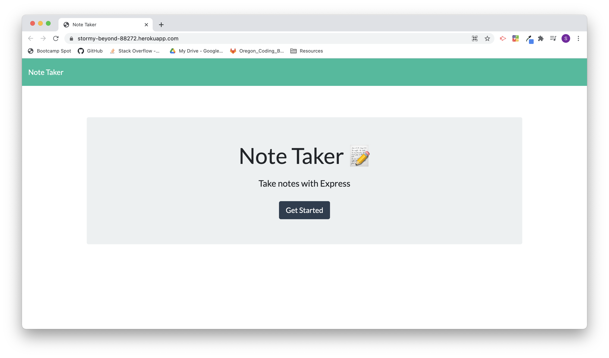
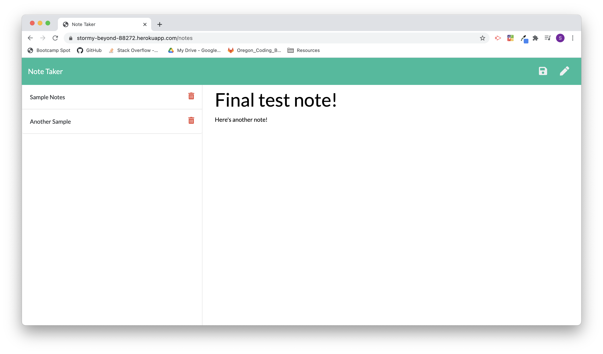

# Express.js Note Taker Application
> TBD.
 
## Table of contents
* [User story](#user-story)
* [General info](#general-info)
* [Screenshots](#Screenshots)
* [Technologies](#technologies)
* [Live Link](#example-html)
* [Code Snippet](#code-snippet)
* [Sources](#sources)
* [Contact](#contact)

## User story
AS A small business owner  
I WANT to be able to write and save notes  
SO THAT I can organize my thoughts and keep track of tasks I need to complete  

## General info
TBD.

## Screenshots



## Technologies
* HTML
* CSS
* JavaScript
* Node
* NPM Express

## Live link
[Express.js Note Taker Application](https://stormy-beyond-88272.herokuapp.com/)

## Code snippets

The below example code shows the setup and initialization for the Express server:
```js
// Add required dependencies
const express = require('express');
const path = require('path');

// Create express app
const app = express();
const PORT = process.env.PORT || 8080;

// Set up middleware to parse json file
app.use(express.urlencoded({ extended: true }));
app.use(express.json());
app.use(express.static('./public'));

// Require routes files for both API routes and HTML routes
require('./routing/api-routes')(app);
require('./routing/html-routes')(app);

// Invoke listen function on Express app
app.listen(PORT, function() {
    console.log(`App listening on Port: ${PORT}`);
});
```

The below example code shows the routing setup for the HTML routes: 
```js
// Add required dependencies
const path = require('path');
const fs = require('fs');

// Set up HTML routes export for server.js page
module.exports = function (app) {

    app.get('/', function(req, res) {
        res.sendFile(path.join(__dirname, '/../public/index.html'));
    });

    app.get('/notes', function(req, res) {
        res.sendFile(path.join(__dirname, '/../public/notes.html'));
    });

};
```

The below example code shows the routing setup for the API routes:
```js
// Add required dependencies
const path = require('path');
const fs = require('fs');
const generateUniqueId = require('generate-unique-id');

// Require HTML routes file
require('./html-routes');

// Set up API routes export for server.js page
module.exports = function (app) {
    fs.readFile('db/db.json', 'utf8', function (err, data) {
        if (err) throw err;
        
        let notes = JSON.parse(data);
      
        app.get('/api/notes', function(req, res) {
            res.json(notes);
        })

        app.post('/api/notes', function(req, res) {
            
            const activeNote = {
                title: req.body.title,
                text: req.body.text,
                id: generateUniqueId({
                    length: 10,
                    useLetters: true,
                    useNumbers: true
                })
            };
            notes.push(activeNote);
            updateNotes(notes);
            res.json(notes);
        })

        app.get('/api/notes/:id', function(req, res) {
            res.json(notes[req.params.id]);
        })

        app.delete('/api/notes/:id', function(req, res) {
            notes.splice(req.params.id, 1);
            updateNotes(notes);
            res.json(notes);
        })
    })

    function updateNotes(notes) {
        fs.writeFile('db/db.json', JSON.stringify(notes, '\t'), function(err) {
            if (err) throw err;
            return true;
        })
    };
};
```

## Sources
Application enabled using the following sources:

* [NPM Express](https://expressjs.com/)
* [NPM Generate Unique ID](https://www.npmjs.com/package/generate-unique-id)

## Contact
Created by Sam Rogers - feel free to contact me to collaborate on this project or any other project!

[LinkedIn](https://www.linkedin.com/in/samuelerogers/)

[Portfolio](https://samrogers15.github.io/Current_Portfolio/index.html)